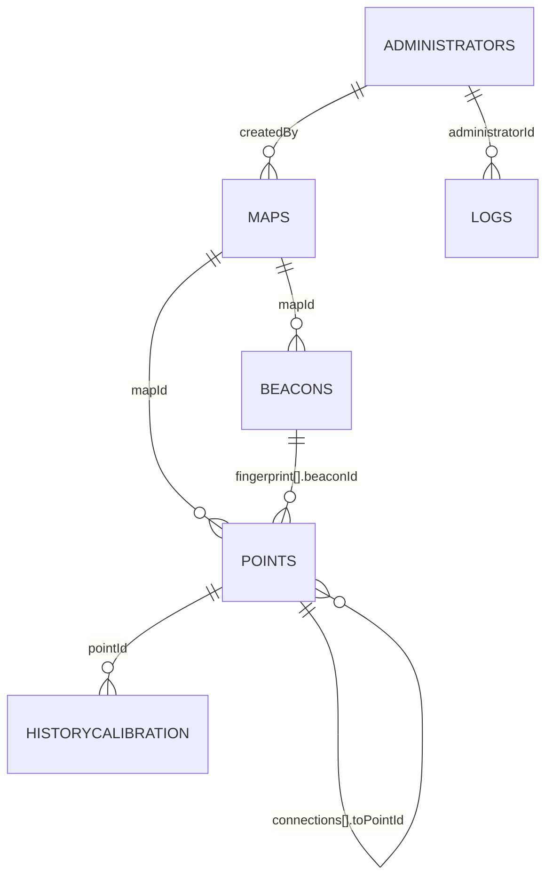

# Modelagem do Firestore — Navegação Indoor KMP

> Documento de referência **canônico** do schema do Firestore. Qualquer coleção, campo ou
> relação usada no código (`data/`, `firestore.rules`) ou descrita no TCC deve corresponder ao
> que está aqui. Divergência encontrada no código é bug a corrigir, não uma segunda verdade —
> ver [Estado de implementação atual vs. este documento](#estado-de-implementação-atual-vs-este-documento).
> Ver também `.claude/CLAUDE.md` seção 9 ("Não invente o schema do Firestore").

## Objetivo deste documento

Definir, para cada coleção do Firestore, **por que ela existe** (que parte do produto ela
serve) e **como seus campos são consumidos**, não só o formato. Modelagem de dado não é um fim
em si — cada campo aqui existe porque algum fluxo do app (posicionamento WKNN, roteamento
Dijkstra, guia de acessibilidade por voz, RBAC do painel admin) precisa dele. Campos sem
consumidor conhecido foram removidos da versão anterior; ver a tabela de mudanças no final.

## Contexto do produto (recapitulando `CLAUDE.md` §0)

App de navegação indoor para pessoas com deficiência visual: **beacons BLE (iBeacon)** +
**fingerprinting RSSI (KNN/WKNN)** estimam a posição do usuário; **Dijkstra** calcula a rota
sobre um grafo de PRs (pontos de referência); o resultado vira **instrução por voz**. O painel
administrativo (única parte do app com escrita) é onde esse grafo, os beacons e as amostras de
calibração são cadastrados. Toda decisão de schema abaixo existe para servir um desses dois
lados — cadastro administrativo ou consumo em tempo real pelo usuário final.

---

## Princípios de modelagem adotados

Regras que foram aplicadas de forma consistente nas seis coleções, para não repetir a
justificativa em cada uma:

1. **Sem campo `id` duplicado dentro do documento.** O ID do documento (`doc.id`) já é a chave
   primária no Firestore; guardá-lo de novo como campo é redundância que pode divergir do ID
   real sem que nada acuse o erro. Nenhuma coleção abaixo tem campo `id`.
2. **`floor` mora só em `maps`.** Cada documento `maps` representa exatamente um andar/setor
   (é a própria definição da coleção). `points` e `beacons` chegam ao andar via `mapId →
   maps.floor` — duplicar `floor` neles permitiria um beacon "discordar" do próprio mapa a que
   pertence, sem nada no Firestore para impedir.
3. **Toda referência cruzada (`mapId`, `pointId`, `beaconId`) é um ID de string, nunca uma
   segunda cópia de dado do documento referenciado.** Se dois campos podem divergir e um é
   sempre derivável do outro, o derivável é removido (ex.: `historyCalibration` não guarda mais
   `mapId`, só `pointId` — o mapa já vem de `points.mapId`).
4. **Timestamps de ciclo de vida são dois campos, não um.** `createdAt` (imutável) e
   `updatedAt` (muda a cada escrita permitida) — nunca um único `updatedAt` fazendo o papel dos
   dois, porque isso perde o histórico de criação no primeiro update real.
5. **Todo campo de tipo fechado é um enum de valores fixos, documentado aqui e validado na
   Firestore Rule (`in [...]`)** — nunca string livre digitada pelo cliente. Evita que um typo
   silencioso ("Banheiro" vs "banheiro") quebre filtro/ícone rio abaixo.
6. **Coordenadas de pixel (`x`, `y`) só fazem sentido junto da dimensão da imagem que as
   originou.** Todo consumidor de `points.x/y` ou `beacons.x/y` precisa também de
   `maps.imageWidthPx/imageHeightPx` — guardado uma vez, na escrita autoritativa do mapa, em
   vez de redescoberto em runtime por cada consumidor (hoje, baixando e decodificando a imagem).
7. **Dado agregado (hot path de leitura) e dado bruto (histórico) ficam em coleções
   separadas**, com um fluxo documentado de como um vira o outro — ver
   [Fluxos de dados entre coleções](#fluxos-de-dados-entre-coleções). É o padrão já certo entre
   `historyCalibration` (bruto) e `points.fingerprint` (agregado); mantido.

---

## Diagrama de relacionamento

---

## `maps/{mapId}`

**Objetivo:** representa um andar/bloco/setor navegável do ambiente — a unidade que o app
carrega por vez para otimizar desempenho (não existe "mapa do prédio inteiro" como documento
único; um prédio de 3 andares é 3 documentos `maps`). É também o espaço de coordenadas
(pixels da imagem) contra o qual `points` e `beacons` se posicionam, e a unidade de
visibilidade administrativa (quem pode ver/editar).

| Campo | Tipo | Obrigatório | Descrição |
|---|---|---|---|
| `name` | string | sim | Nome exibido no painel (ex.: "Bloco B — Térreo"). |
| `description` | string | não | Descrição livre para o admin. |
| `imageUrl` | string | sim | URL da imagem raster (PNG/JPEG/WebP) da planta baixa. **Renomeado de `svgUrl`** — o campo nunca guardou SVG vetorial de fato, ver [mudanças](#o-que-mudou-em-relação-à-versão-anterior-e-por-quê). |
| `imageWidthPx` | number (int) | sim | Largura intrínseca da imagem em pixels, capturada no cadastro. Base para interpretar `x`/`y` de `points`/`beacons` deste mapa. |
| `imageHeightPx` | number (int) | sim | Altura intrínseca em pixels, mesma finalidade. |
| `scale` | number | sim | Metros por pixel. É o que converte o grafo de pixels em distância real — consumido pelo cálculo de peso das arestas em `points.connections` e por qualquer heurística de posicionamento baseada em distância física. |
| `floor` | number (int) | sim | Nível do andar dentro do `sector` (ex.: 0 = térreo). Único lugar do schema onde andar é armazenado — ver princípio 2. |
| `sector` | string | sim | Identificador do prédio/bloco (ex.: `"bloco-b"`). Usado para escopo de visibilidade administrativa — deve casar exatamente (case-sensitive) com `administrators.sector`. |
| `createdBy` | string (uid) | sim | UID do admin autor. |
| `createdAt` | timestamp | sim | `ServerTimestamp`, gravado uma vez. |
| `updatedAt` | timestamp | sim | Igual a `createdAt` enquanto `maps` for write-only (sem update); existe desde já para não migrar dado quando update for liberado. |
| `isActive` | boolean | sim (default `true`) | Soft-delete. **Só é significativo se toda leitura (`observeMaps`) filtrar por ele** — ver nota de implementação. |

**Política de acesso (alto nível):** leitura restrita a admins autenticados cujo
`sector` (custom claim) bate com `maps.sector`, ou com `role == "superadmin"`. Escrita
(`create`) exige `createdBy == request.auth.uid` e todos os campos obrigatórios acima
presentes e válidos (hoje a rule só valida `name`/`svgUrl` — precisa ser estendida para cobrir
`scale`/`floor`/`sector`/`imageWidthPx`/`imageHeightPx`, ver seção de implementação).

---

## `administrators/{administratorId}`

**Objetivo:** registro de quem pode operar o painel administrativo. **Não guarda credencial
nenhuma** (senha fica inteiramente no Firebase Auth) — só metadado de identidade e
autorização, e é o lado do vínculo "qual admin pode ver qual mapa" pedido para esta revisão.

| Campo | Tipo | Obrigatório | Descrição |
|---|---|---|---|
| `name` | string | sim | Nome de exibição. |
| `email` | string | sim | Espelha o e-mail do Firebase Auth (não é fonte de verdade de login, só exibição/contato). |
| `role` | string, enum: `"superadmin" \| "editor"` | sim | Controla **visibilidade**: `superadmin` enxerga todos os `sector`; `editor` só o próprio `sector`. Mesmo valor deve ser espelhado como **custom claim** do Firebase Auth (CLAUDE.md §5) para a Firestore Rule decidir sem ler outro documento. |
| `permissions` | array\<string\>, enum fechado por item | não (default `[]`) | Controla **ações** dentro do que `role`/`sector` já permite enxergar (ex.: `"delete_beacon"`, `"recalculate_fingerprint"`). Não decide visibilidade — só o que fazer com o que já é visível. Conjunto inicial sugerido: `create_map`, `create_point`, `create_beacon`, `record_calibration`, `recalculate_fingerprint`, `deactivate_content`. |
| `sector` | string \| null | obrigatório se `role == "editor"` | Deve casar exatamente com `maps.sector` dos mapas que este admin pode ver. Ignorado se `role == "superadmin"`. |
| `createdAt` | timestamp | sim | |
| `updatedAt` | timestamp | sim | |
| `lastAccess` | timestamp | não | Último login bem-sucedido — escrito **uma vez por sessão** por `AdminSessionRepository`, não a cada ação (isso já é o papel de `logs`). |

**Política de acesso:** leitura só para o próprio admin autenticado ler seu próprio documento
(mínimo necessário para o app resolver `role`/`sector`/`permissions` no client). **Escrita
sempre negada a qualquer client** — cadastro/edição de administrador é operação sensível o
bastante (concede acesso a todo o resto do schema) para exigir Console/Cloud Function, nunca
caminho client-side. Isso é mais restrito que o stub atual (`allow read: if request.auth !=
null`, que deixa qualquer autenticado ler a coleção inteira).

---

## `beacons/{uuid_major_minor}`

**Objetivo:** os transmissores BLE físicos que o app escaneia para estimar a posição do
usuário via WKNN (CLAUDE.md §3). O ID do documento **não é auto-gerado** — é a chave composta
`"${uuid}_${major}_${minor}"` (ex.: `f7826da6-4fa2-4e98-8024-bc5b71e0893e_1_10`).

> **Por que ID composto, não auto-ID:** esse trio é como o scanner BLE identifica *qual*
> beacon físico foi detectado. Se dois documentos duplicassem o mesmo trio, o WKNN puxaria
> dado de calibração do beacon errado **silenciosamente** — sem crash, só posição errada, que
> para um usuário com deficiência visual é o pior tipo de falha possível. Firestore não tem
> constraint de unicidade nativa fora do ID do documento; usar o trio como ID é a forma de
> ganhar essa garantia de graça.

| Campo | Tipo | Obrigatório | Descrição |
|---|---|---|---|
| `mapId` | string (ref → `maps/{mapId}`) | sim | Andar onde o beacon está fisicamente instalado. |
| `uuid` | string | sim | Também codificado no ID do documento; mantido como campo para leitura direta sem parsear o ID. |
| `major` | number (int) | sim | Idem. |
| `minor` | number (int) | sim | Idem. |
| `name` | string | sim | Nome de exibição no painel (ex.: "Beacon corredor B-2"). |
| `description` | string | não | |
| `x` | number (int) | sim | Pixel na imagem de `maps.imageUrl` (ver princípio 6). |
| `y` | number (int) | sim | Idem. |
| `txPower` | number | sim | RSSI calibrado a 1 metro — constante física injetada no estimador WKNN (CLAUDE.md §3, "constantes físicas... nunca literais mágicos"). |
| `battery` | number \| null | não | Última leitura conhecida, melhor esforço — **não é telemetria ao vivo garantida** (nada no schema hoje escreve nele periodicamente; tratar como informativo). |
| `createdBy` | string (uid) | sim | |
| `createdAt` | timestamp | sim | |
| `updatedAt` | timestamp | sim | |
| `isActive` | boolean | sim (default `true`) | Beacon fisicamente removido/trocado sem apagar o histórico de calibração que o referencia. |

**Política de acesso:** leitura igual a `maps` (escopo por `sector`, via `mapId → maps.sector`
— exige `get()` na Rule ou desnormalizar `sector` aqui; avaliar custo ao implementar). Escrita
deve ser **mais restrita** que `maps`/`points` — um beacon forjado ou malposicionado envenena
o posicionamento de todo mundo que usa aquele andar, não só um registro isolado.

---

## `points/{pointId}`

**Objetivo:** dupla função — (1) os nós do grafo de navegação que o Dijkstra percorre (PRs —
pontos de referência), e (2) o local onde vive o *fingerprint* agregado que o WKNN compara
contra a leitura RSSI ao vivo. É a coleção mais central do schema.

| Campo | Tipo | Obrigatório | Descrição |
|---|---|---|---|
| `mapId` | string (ref → `maps/{mapId}`) | sim | |
| `type` | string, enum: `"room" \| "bathroom" \| "stairs" \| "elevator" \| "entrance" \| "exit" \| "point_of_interest" \| "connector"` | sim | Tipo fechado — dirige ícone/filtro na UI. `"connector"` é um PR que só existe para ligar dois andares (topo/base de uma escada/elevador), sem instrução de "chegada" própria. |
| `name` | string | sim | |
| `description` | string | não | |
| `instruction` | string | sim | Texto falado via TTS ao chegar neste PR (requisito de acessibilidade, CLAUDE.md §2) — nunca vazio para PRs que não sejam `"connector"`. |
| `x` | number (int) | sim | Pixel na imagem de `maps.imageUrl` referenciado por `mapId`. |
| `y` | number (int) | sim | Idem. |
| `isAccessible` | boolean | sim | Indica se o caminho até este PR é acessível (cadeira de rodas/mobilidade reduzida). |
| `connections` | array\<map\> | sim (default `[]`) | Arestas do grafo de navegação — ver estrutura abaixo. |
| `connections[].toPointId` | string | sim | ID de outro `points`, **pode estar em outro `mapId`** (ex.: ligação entre andares por escada/elevador). |
| `connections[].weightMeters` | number | sim | Custo real da aresta em metros. Para conexões no **mesmo mapa**, pode ser sugerido automaticamente (distância euclidiana de `(x,y)` × `maps.scale`) e o admin confirma/ajusta. Para conexões **entre mapas diferentes**, não existe distância euclidiana válida (pixels de documentos diferentes não têm relação entre si) — **precisa ser inserido manualmente** pelo admin. |
| `fingerprint` | array\<map\> | sim (default `[]`) | Cache agregado, consumido diretamente pelo estimador WKNN em tempo real — ver estrutura abaixo. |
| `fingerprint[].beaconId` | string | sim | ID do documento em `beacons` (o trio `uuid_major_minor`). |
| `fingerprint[].rssiMean` | number | sim | |
| `fingerprint[].rssiStdDev` | number | sim | |
| `fingerprint[].sampleCount` | number (int) | sim | Quantas amostras brutas sustentam essa média — permite à UI/algoritmo ponderar confiança de um fingerprint com poucas amostras. |
| `fingerprintUpdatedAt` | timestamp \| null | não | Quando o agregado acima foi recalculado a partir de `historyCalibration` pela última vez — permite o painel avisar "fingerprint desatualizado" se uma calibração nova não foi propagada (ver [fluxos de dados](#fluxos-de-dados-entre-coleções)). |
| `createdBy` | string (uid) | sim | |
| `createdAt` | timestamp | sim | |
| `updatedAt` | timestamp | sim | |
| `isActive` | boolean | sim (default `true`) | |

**Invariante de escrita:** `connections` é bidirecional — se `A.connections` contém `B`,
`B.connections` deve conter `A` de volta com o mesmo `weightMeters`. Isso **não é imposto pelo
Firestore**; o caminho de escrita (transação/batch) é responsável por gravar os dois lados
atomicamente. Documentar isso explicitamente no código que implementar o cadastro de conexão.

**Política de acesso:** mesma lógica de escopo por `sector` de `maps`/`beacons`.

---

## `historyCalibration/{calibrationId}`

**Objetivo:** registro **imutável** de uma sessão de calibração offline (fingerprinting) em um
PR — a fonte bruta da qual `points.fingerprint` é derivado. Fica separada de `points` para não
perder histórico de recalibrações toda vez que o agregado é recalculado.

| Campo | Tipo | Obrigatório | Descrição |
|---|---|---|---|
| `pointId` | string (ref → `points/{pointId}`) | sim | `mapId` **removido** desta coleção — é sempre derivável via `points.mapId`; ver princípio 3. |
| `beacons` | array\<map\> | sim | |
| `beacons[].beaconId` | string | sim | |
| `beacons[].rssiSamples` | array\<number\> | sim | Amostras brutas coletadas nesta sessão. |
| `beacons[].rssiMean` | number | sim | |
| `beacons[].rssiStdDev` | number | sim | |
| `beaconsCount` | number (int) | sim | Quantidade de beacons cobertos nesta sessão (redundante com `beacons.length`, mantido como campo por conveniência de query/exibição sem baixar o array inteiro). |
| `createdBy` | string (uid) | sim | |
| `createdAt` | timestamp | sim | |

Sem `updatedAt` — este documento **nunca é editado** após criado, é histórico puro.

**Política de acesso:** leitura escopada por `sector` (via `pointId → points.mapId →
maps.sector`); escrita permitida a qualquer admin com permissão `"record_calibration"` no seu
`sector`; sem update/delete.

---

## `logs/{logId}`

**Objetivo:** trilha de auditoria de ações administrativas (CLAUDE.md §5). A versão anterior
não tinha *quem* executou a ação — o gap mais importante corrigido aqui.

| Campo | Tipo | Obrigatório | Descrição |
|---|---|---|---|
| `administratorId` | string (uid) | sim | **Novo.** Sem isso, o log não serve para auditoria de verdade. |
| `action` | string, enum: `"admin_login" \| "admin_logout" \| "map_created" \| "point_created" \| "beacon_created" \| "calibration_recorded" \| "fingerprint_recalculated"` | sim | Conjunto vivo (cresce conforme novas ações administrativas existirem), mas sempre fechado — nunca string livre. |
| `targetType` | string \| null, enum: `"map" \| "point" \| "beacon" \| "administrator" \| null` | não | `null` para ações sem alvo único (ex.: login/logout). |
| `targetId` | string \| null | não | ID do documento alvo, junto com `targetType`. |
| `mapId` | string \| null | não | Campo de conveniência **denormalizado**, preenchido quando a ação tem um mapa associado (diretamente, ou via o `mapId` do `point`/`beacon` alvo) — só para filtrar "todos os logs deste mapa" na UI sem precisar de N leituras. **Não é autoritativo**: `targetType`/`targetId` é que descreve o alvo real da ação. |
| `details` | string | não | Texto livre complementar (ex.: nome do recurso no momento da ação). |
| `status` | string, enum: `"success" \| "failure"` | sim | |
| `timestamp` | timestamp | sim | `ServerTimestamp`. |

**Confiabilidade do log:** enquanto a escrita partir do próprio client que executa a ação
(estado atual do projeto — não há Cloud Functions configuradas ainda), este log é **melhor
esforço**, não uma prova à prova de admin malicioso (um client comprometido pode simplesmente
não escrever). Tratar como tal na documentação/RNF — não apresentar como controle de segurança
forte até existir uma Cloud Function (trigger em escrita de `maps`/`points`/`beacons`) gerando
o log no backend em vez do client. Ver `firebase.json`/`functions/` inexistentes hoje.

**Política de acesso:** create liberado a qualquer admin autenticado (o próprio ato de logar
não deveria exigir uma permissão extra); leitura só para `role == "superadmin"` (log é dado
sensível de auditoria de outros admins, não escopado por `sector`); sem update/delete nunca —
imutável por definição.

---

## Fluxos de dados entre coleções

O schema só ajuda o projeto se essas ligações entre coleções forem explícitas — sem isso, cada
feature futura reinventa a integração:

1. **Cadastro de mapa** → `maps.imageUrl` + `imageWidthPx/imageHeightPx` + `scale` capturados
   uma vez, no upload. Todo o resto do schema (`points.x/y`, `beacons.x/y`,
   `connections[].weightMeters`) depende desses três valores existirem e nunca mudarem depois
   (mapa é write-once — se precisar trocar a imagem, é um novo `mapId`, não um update).
2. **Calibração offline** → admin fica parado em um `points` físico, coleta amostras RSSI de
   beacons próximos → grava um `historyCalibration` (dado bruto, imutável) → algo (ação manual
   "recalcular fingerprint" no painel, ou futuramente uma Cloud Function em trigger) agrega
   todas as sessões daquele `pointId` e **sobrescreve** `points.fingerprint` +
   `points.fingerprintUpdatedAt`. Sem esse passo de agregação, `historyCalibration` acumula
   dado que o app nunca usa de fato — o consumo em tempo real lê só `points.fingerprint`.
3. **Posicionamento em tempo real (usuário final)** → app escaneia beacons ao vivo → compara
   RSSI lido contra `points.fingerprint` de todos os PRs do `mapId` atual (WKNN) → estima o PR
   mais provável.
4. **Cálculo de rota** → a partir do PR estimado, Dijkstra percorre `points.connections`
   (pesos em metros, já reais graças a `maps.scale`) até o PR de destino — inclusive
   atravessando `mapId`s diferentes quando a aresta é um `"connector"` (escada/elevador).
5. **Visibilidade administrativa** → `administrators.role`/`sector` (espelhados como custom
   claim do Firebase Auth) decidem quais `maps` (e, por `mapId`, quais `points`/`beacons`) um
   admin enxerga no painel — ver rule de `maps` acima.
6. **Auditoria** → toda escrita administrativa em `maps`/`points`/`beacons`/`historyCalibration`
   deveria gerar um `logs` correspondente com `administratorId` preenchido — hoje nenhum use
   case do código faz isso ainda (ver seção seguinte).

---

## O que mudou em relação à versão anterior, e por quê

| Antes | Depois | Motivo |
|---|---|---|
| `id` em todo documento | Removido | Redundante com `doc.id`; podia divergir sem detecção. |
| `floor` em `maps`, `points` e `beacons` | Só em `maps` | Triplicava o mesmo dado; nada impedia inconsistência entre um PR/beacon e o próprio mapa a que pertence. |
| `maps.svgUrl` | `maps.imageUrl` | Campo nunca guardou SVG vetorial (é raster via Coil3) — nome já era sinalizado como pendente de correção. |
| `maps.updateAt` (único timestamp) | `createdAt` + `updatedAt` | Um único campo perde o histórico de criação assim que updates forem liberados. |
| — (não existia) | `maps.imageWidthPx`/`imageHeightPx` | Sem isso, `x`/`y` de `points`/`beacons` só são interpretáveis baixando e decodificando a imagem em runtime. |
| — (não existia) | `maps.sector` + `administrators.sector`/`role` | Pedido desta revisão: vínculo de quais mapas cada admin pode ver. |
| `administrators.permissions` (papel ambíguo com `role`) | `role` decide visibilidade, `permissions` decide ação | Os dois campos existiam sem regra de precedência — risco de um dizer uma coisa e o outro, outra. |
| `beacons` com auto-ID | ID = `"${uuid}_{major}_{minor}"` | Garante unicidade do trio que o WKNN usa para identificar o beacon físico — sem isso, dois documentos duplicados corrompem silenciosamente o posicionamento. |
| `beacons.batery` (typo) | `beacons.battery`, documentado como melhor-esforço | Corrige typo; esclarece que não é telemetria ao vivo garantida. |
| `points.concectedPoints: array<string>` (typo, sem peso) | `points.connections: array<map>{toPointId, weightMeters}` | IDs sem peso não dão para o Dijkstra decidir custo — e conexões entre andares (escada/elevador) não têm distância euclidiana válida entre pixels de mapas diferentes; precisam de peso explícito. |
| `points.isAccesible` (typo) | `points.isAccessible` | Corrige typo. |
| `points.fingerprint[]` sem contagem de amostras | + `sampleCount`, + `points.fingerprintUpdatedAt` | Sem isso não dá pra saber se um fingerprint é confiável (poucas amostras) nem se está desatualizado em relação a `historyCalibration`. |
| `historyCalibration.mapId` | Removido | Sempre derivável de `pointId → points.mapId`; os dois podiam divergir sem detecção. |
| `historyCalibration.ressiMean`/`ressiStdDev` (typo) | `rssiMean`/`rssiStdDev` | Corrige typo, alinha com `points.fingerprint`. |
| `historyCalibration.updatedAt` | Removido | Documento é histórico imutável; não deveria ser editável para começo de conversa. |
| `logs` sem autor | `logs.administratorId` (obrigatório) | Sem isso não é auditoria — é só um registro de "algo aconteceu". |
| `logs.mapId` único campo de contexto | `targetType`/`targetId` (+ `mapId` como conveniência denormalizada explícita) | Nem toda ação administrativa é sobre um mapa (login, gestão de administrador); referência polimórfica cobre isso sem forçar `mapId` vazio/nulo como caso especial constante. |
| `logs.status` string livre | Enum fechado (`success`/`failure`) | Consistência com CLAUDE.md §7 ("enum para tipos fechados"). |

---

## Estado de implementação atual vs. este documento

Igual ao padrão já usado em `CLAUDE.md` §1 — isto descreve o schema **alvo**, não o que já
existe. Principais divergências do código hoje (`feature/admin/login/src/commonMain/.../data/`,
`firestore.rules`) em relação a este documento:

- `MapDto` (leitura) só devolve `name`/`svgUrl`; `NewMapDto` (escrita) já grava `description`,
  `scale`, `floor`, `createdBy`, `isActive`, `updatedAt` — mas nada lê esses campos de volta.
  Precisa fechar esse drift ao migrar para o schema acima (e adicionar
  `imageWidthPx`/`imageHeightPx`/`sector`, que nem são gravados ainda).
- `svgUrl` ainda não foi renomeado para `imageUrl` no código.
- `beacons`, `historyCalibration` e `logs` não têm nenhuma implementação (DTO, entidade,
  repositório) ainda — só existem neste documento e no `firestore.rules` como comentário.
- `administrators` hoje é um stub (`allow read: if request.auth != null`, sem `role`/`sector`
  nem custom claims) — a política de acesso descrita acima ainda não está implementada.
- `points.connections` (com peso) e `points.fingerprint`/`fingerprintUpdatedAt` não existem no
  domínio atual — hoje `points` só tem `mapId`, `name`, `description`, `x`, `y`.
- Nenhum use case (`CreateMapUseCase`, `CreatePointUseCase`) escreve em `logs` hoje.

Nenhuma dessas divergências deve ser "corrigida" silenciosamente por um agente sem revisão —
cada uma é um diff revisável separado, seguindo `CLAUDE.md` §9 ("prefira diffs pequenos e
revisáveis"), idealmente via skill `firestore-collection` por coleção.

---

## Convenções gerais

- Tipos Firestore: `number` inteiro é gravado como Firestore `int`/`Long` em Kotlin; `number`
  decimal como `double`. Nunca misturar as duas representações para o mesmo campo entre
  documentos da mesma coleção.
- Todo timestamp usa `Timestamp.ServerTimestamp` do GitLive SDK — nunca hora do cliente
  (`Clock.System.now()`), que pode estar errada/manipulada.
- `isActive` só é uma soft-delete real se **toda** query de leitura da coleção filtrar por ele
  desde o dia em que o campo existe — um campo `isActive` que nenhuma leitura considera é pior
  que não ter o campo (falsa sensação de capacidade).
- Todo campo `enum` (string fechada) documentado aqui deve ter a Firestore Rule
  correspondente validando com `in [...]`, nunca só `is string`.
